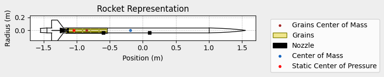
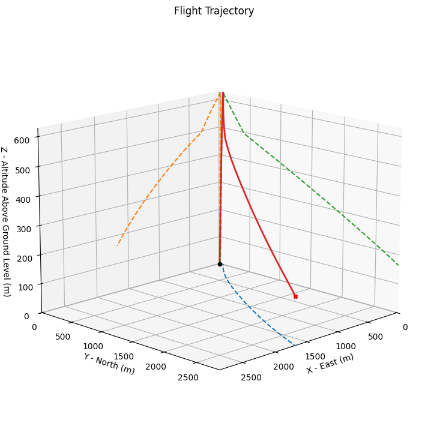
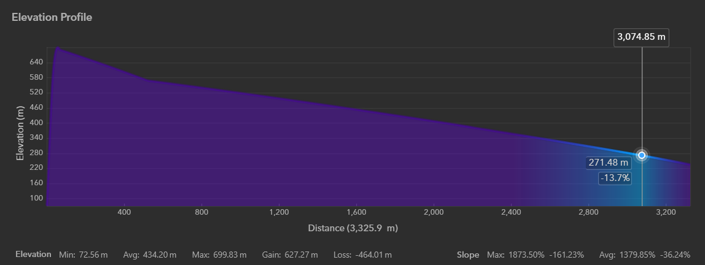
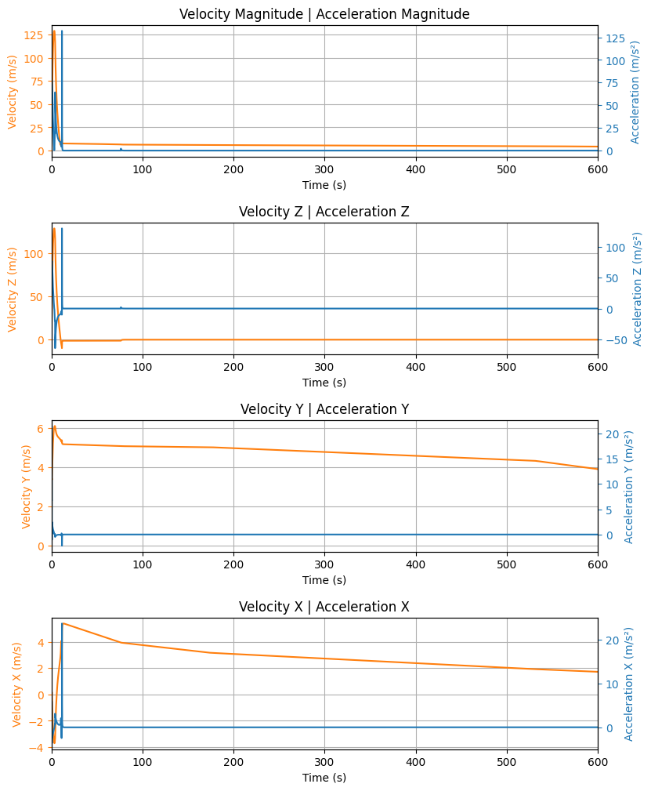
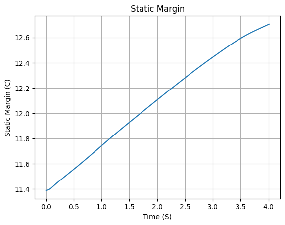
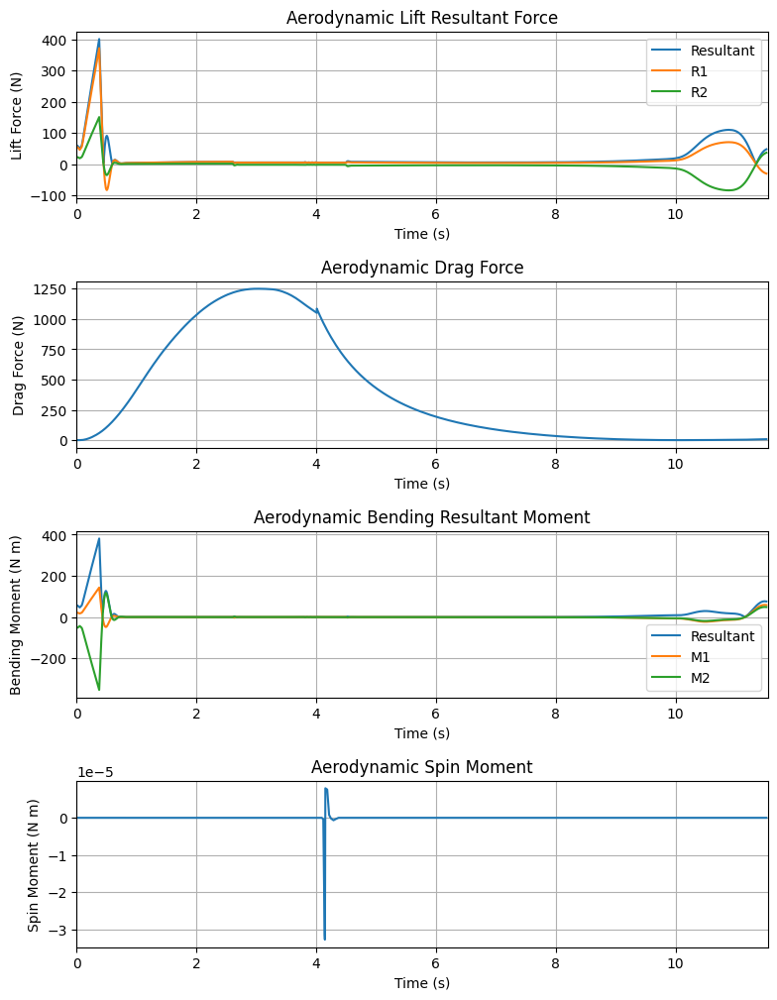

# 🚀 AEGIS-75 High-Power Rocket Flight Simulation
A physics-based **6-Degree-of-Freedom (6-DOF)** flight simulation of the **AEGIS-75** high-power sounding rocket developed using **RocketPy**. This project models rocket propulsion, aerodynamics, atmospheric conditions, stability, and dual-deployment parachute recovery to predict flight performance under realistic launch conditions.

## 📌 Project Overview
The objective of this project is to design, model, and simulate a **75 mm diameter high-power sounding rocket** using RocketPy. The simulation evaluates the rocket's flight dynamics, propulsion performance, aerodynamic stability, and recovery sequence before physical implementation.

The project demonstrates the application of computational tools in preliminary rocket design and performance analysis.

## ✨ Features
- 🚀 Complete 6-DOF rocket flight simulation
- 🔥 AeroTech M1850W solid rocket motor modelling
- 🌎 Real atmospheric forecast (GFS weather model)
- 📈 Aerodynamic stability analysis
- 📊 Custom power-on and power-off drag models
- 🪂 Dual-deployment parachute recovery
- 📉 Flight trajectory and performance visualization
- 📍 Google Earth trajectory export (KML)

# 🛠 Technologies Used
- Python
- RocketPy
- NumPy
- Matplotlib
- Google Colab

# 🚀 Rocket Specifications
| Parameter | Value |
|-----------|------:|
| Rocket Name | AEGIS-75 |
| Diameter | 75 mm |
| Length | 3.10 m |
| Empty Mass | 18.0 kg |
| Loaded Mass | 22.87 kg |
| Nose Cone | Von Kármán |
| Fin Configuration | Four Trapezoidal Fins |
| Recovery System | Dual Deployment |
| Launch Rail Length | 6.0 m |
| Launch Inclination | 85° |

# 🔥 Motor Specifications
| Parameter | Value |
|-----------|------:|
| Motor | AeroTech M1850W |
| Burn Time | 4.01 s |
| Propellant Mass | 2.956 kg |
| Average Thrust | 1679.50 N |
| Maximum Thrust | 2411 N |
| Total Impulse | 6734.78 Ns |
| Average Exhaust Velocity | 2278.41 m/s |

# 🌎 Launch Environment
The simulation was performed using **RocketPy's Forecast Atmospheric Model (GFS)**.
| Parameter | Value |
|-----------|------:|
| Latitude | 19.15025° |
| Longitude | 73.23245° |
| Elevation | 72.6 m |
| Surface Wind Speed | 2.48 m/s |
| Surface Temperature | 298.13 K |
| Launch Date | 30 June 2026 |

# 📊 Simulation Results
| Parameter | Result |
|-----------|-------:|
| Apogee | **699.83 m** |
| Burnout Altitude | 385.41 m (AGL) |
| Burnout Velocity | 118.58 m/s |
| Maximum Velocity | **128.90 m/s** |
| Maximum Mach Number | **0.373** |
| Rail Exit Velocity | 27.36 m/s |
| Burn Time | 4.01 s |
| Maximum Motor Acceleration | 95.79 m/s² (9.77 g) |
| Maximum Stability Margin | 12.753 calibers |

# 📈 Engineering Analysis
The following analyses were performed:
- Rocket Geometry
- Atmospheric Conditions
- Aerodynamic Drag Analysis
- Stability Analysis
- 3D Flight Trajectory
- Elevation Profile
- Linear Kinematics
- Angular Motion
- Aerodynamic Forces
- Dynamic Pressure
- Energy Analysis
- Parachute Recovery Sequence

# 📷 Simulation Outputs
## Rocket Geometry


## 3D Flight Trajectory


## Google Earth Elevation Profile


## Linear Kinematics


## Stability Analysis


## Aerodynamic Forces


## Energy Analysis


# 📂 Repository Structure

AEGIS-75-Rocket-Simulation/

── notebook/
   └── AEGIS75_RocketPy.ipynb
 
── motor/
   └── AeroTech_M1850W.rse

── airfoil/
   └── NACA0012-radians.txt

── drag_curves/
   ├── powerOnDragCurve.csv
   └── powerOffDragCurve.csv

── results/
   ├── trajectory.kml
   ├── plots/
   └── images

── report/
   └── Project Aegis 75.pdf

── README.md
```

# ▶️ Getting Started
### Clone the Repository

```bash
git clone https://github.com/Anuj-777/AEGIS-75-Rocket-Simulation
```

### Install Dependencies
```bash
pip install rocketpy numpy matplotlib
```

### Run the Simulation
Open the notebook in **Google Colab** or **Jupyter Notebook** and execute all cells sequentially.

# 🔍 Key Learnings
Through this project, the following concepts were explored:
- High-Power Rocket Design
- Flight Dynamics
- Six-Degree-of-Freedom Simulation
- Aerodynamic Stability
- Solid Rocket Propulsion
- Atmospheric Modelling
- Numerical Simulation using Python
- Data Visualization
- Engineering Performance Analysis

# 🚀 Future Improvements
- Replace estimated aerodynamic coefficients with CFD/OpenRocket data.
- Validate simulation results using experimental flight data.
- Perform Monte Carlo analysis for wind and manufacturing uncertainties.
- Optimize fin geometry for improved aerodynamic performance.
- Integrate telemetry and sensor fusion for hardware-in-the-loop simulation.

# 👨‍💻 Author
**Anuj Mangaj**
Aerospace Engineering Student | IIT KHARAGPUE

**Interests**
- Flight Dynamics
- Rocket Propulsion
- Mechanism Design
- Aerospace Structures
- Embedded Systems
- Control Systems
- Numerical Simulation

# 📄 License
This project is licensed under the MIT License.

## ⭐ Acknowledgements
- RocketPy Development Team
- AeroTech Rocket Motors
- Open-source Aerospace Community

